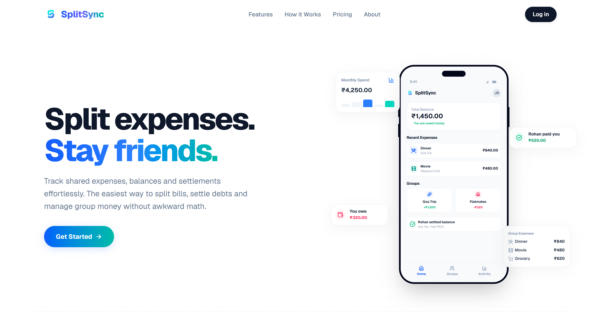

<div align="center">
<p align="center">
  
</p>
  
# SplitSync
### Split expenses. Not friendships.

### A full-stack expense splitting app with AI receipt scanning, real-time notifications, and bank-grade row-level security — built on Next.js 16 and Supabase.

<br />


</div>

<br />

---

## 01 — Product Preview

<p align="center">
  <strong>Split expenses. Stay friends.</strong><br/>
  A modern expense-sharing experience built with Next.js, Supabase and AI-powered receipt scanning.
</p>

### Product Screens

| Dashboard | Group View | Receipt Scanner |
|:---:|:---:|:---:|
|  |  |  |

| Analytics | Expenses | Notifications |
|:---:|:---:|:---:|
|  |  |  |

---

## 02 — Key Capabilities

|  | Capability | What it does |
|---|---|---|
| 🤖 | **AI Receipt Scanning** | Photograph a receipt — Gemini extracts merchant, items, tax, and total automatically |
| ⚡ | **Smart Expense Splitting** | Equal, exact-amount, and percentage splits with cent-accurate rounding correction |
| 🔄 | **Debt Simplification** | Greedy algorithm minimizes the number of settlement transactions across a group |
| 🔔 | **Real-Time Notifications** | Instant in-app alerts via Supabase Realtime when expenses are added or settled |
| 💰 | **Personal Budgets** | Monthly spending limits with category-level tracking, independent of group activity |
| 📊 | **Financial Analytics** | Category breakdowns, monthly trends, group comparisons, and top-expense reports |
| 🔒 | **Row-Level Security** | Every table enforces RLS — users can only access data they're authorized to see |
| 📱 | **PWA Support** | Installable on mobile home screens with web app manifest and optimized touch UX |

---

## 03 — What is SplitSync?

SplitSync helps groups of people track shared expenses, calculate who owes whom, and settle debts with minimal friction.

**The problem:** Splitting expenses manually leads to forgotten payments, disputes, and spreadsheet fatigue.

**Who it's for:** Roommates, travel groups, couples, and anyone who regularly shares costs.

**What makes it different:**
- AI-powered receipt OCR via Google Gemini, running entirely server-side
- Multiple split modes with penny-perfect accuracy (no rounding drift)
- A greedy debt-simplification algorithm that minimizes transfer count
- PostgreSQL Row-Level Security on every user-data table
- Personal expense tracking with budgets, separate from group activity
- Real-time notification delivery via Supabase Realtime

---

## 04 — How It Works

```
 ┌──────────┐     ┌──────────┐     ┌──────────┐     ┌──────────┐
 │  Create   │────▶│   Add    │────▶│ Balances │────▶│ Settle   │
 │  Group    │     │ Expenses │     │ Auto-Calc│     │   Up     │
 └──────────┘     └──────────┘     └──────────┘     └──────────┘
```

**1. Create a group** and invite members by username.
**2. Log expenses** — choose who paid, split equally or by custom amounts/percentages.
**3. Balances recalculate** automatically. Debts are simplified to minimize transfers.
**4. Settle up** with one tap — an offsetting payment is created and balances update.

For personal tracking, log expenses independently with 13 categories and set monthly budgets.

---

## 05 — Architecture

```
┌─────────────────────────────────────────────────────────────┐
│                       Client (Browser)                      │
│                                                             │
│   app/           React pages (Next.js App Router)           │
│   components/    Reusable UI (modals, nav, sheets)          │
│   services/      Data-access layer (Supabase queries)       │
│   lib/           Client init, hooks, animation config       │
└────────────┬──────────────────────────┬─────────────────────┘
             │                          │
             │  Supabase JS SDK         │  Server-side fetch
             │                          │
┌────────────▼────────────────┐    ┌────▼─────────────────────┐
│      Supabase (BaaS)        │    │   Next.js API Routes     │
│                             │    │                          │
│   Auth     (email/password) │    │   POST /api/scan-receipt │
│   PostgREST (CRUD API)     │    │         │                │
│   Realtime  (notifications) │    │         ▼                │
│   PostgreSQL (data store)   │    │   Google Gemini API      │
│   RLS policies (per-table)  │    │   (receipt OCR)          │
└─────────────────────────────┘    └──────────────────────────┘
```

**AI Receipt Flow:** Client sends base64 image → server-side API route forwards to Gemini with a structured prompt → Gemini returns JSON (merchant, items, tax, total) → API validates, sanitizes, and returns parsed data. The Gemini API key never reaches the browser.

---

## 06 — Engineering Highlights

> These are the technical decisions that shaped the codebase.

**Greedy Debt Simplification** — `simplifyDebts()` sorts creditors and debtors by magnitude and greedily matches them, producing the minimum number of settlement transactions.

**Cent-Accurate Splitting** — Equal splits distribute remainder cents across the first _N_ members instead of rounding. Percentage splits patch the rounding difference onto the first user, preventing ledger drift.

**Service-Layer Architecture** — All data access lives in `services/` with a consistent `{ success, data, error }` return contract. UI components never call Supabase directly.

**PostgreSQL + RLS** — 8 user-data tables, each with Row-Level Security. Policies enforce group membership checks, ownership validation, and `paid_by` spoofing prevention.

**Iterative RLS Hardening** — 22 migration files document multiple rounds of policy refinement to eliminate infinite-recursion issues with self-referencing checks on `group_members`.

**Real-Time Notifications** — Subscribes to `INSERT` events on the `notifications` table via Supabase Realtime, delivering instant in-app updates without polling.

**Server-Side Gemini Isolation** — The AI key is only referenced in `app/api/scan-receipt/route.js`. Client-facing error messages are sanitized to prevent leaking provider internals.

**RLS Smoke Testing** — `scripts/rls-smoke-test.mjs` programmatically verifies that non-members cannot read groups, insert expenses, or spoof `paid_by` fields.

**Auto-Pending Personal Expenses** — When a group expense is created, personal expense entries are automatically generated for each split participant, bridging group and personal tracking.

---

## 07 — Database & Security

| Layer | Implementation |
|---|---|
| **Database** | PostgreSQL via Supabase — 8 user-data tables, 22 migration files |
| **Auth** | Supabase Auth (email/password) — users identified by UUID |
| **Profiles** | `profiles` table stores usernames and emails, linked to `auth.users` |
| **RLS** | Enabled on every table — `groups`, `group_members`, `expenses`, `expense_splits`, `settlements`, `profiles`, `notifications`, `personal_expenses`, `monthly_budgets` |
| **Data isolation** | Users can only query groups they belong to; personal data is scoped to the owner |
| **Secrets** | Loaded from `.env.local` (gitignored). Client throws immediately if required vars are missing |

---

## 08 — Tech Stack

| Layer | Technology |
|---|---|
| **Framework** | Next.js 16 (App Router, Turbopack, React Compiler) |
| **UI** | React 19, Framer Motion, Lucide React |
| **Styling** | Tailwind CSS 4 |
| **Mobile UX** | react-swipeable, PWA manifest |
| **Database** | PostgreSQL (Supabase) |
| **Auth** | Supabase Auth |
| **Real-time** | Supabase Realtime (Postgres changes) |
| **AI** | Google Gemini API (server-side) |
| **Linting** | ESLint 9, eslint-config-next |

---

## 09 — Project Structure

```
splitsync-app/
├── app/                            # Next.js App Router
│   ├── api/scan-receipt/           #   Server-side Gemini receipt scanning
│   ├── dashboard/                  #   Dashboard, analytics, expenses pages
│   ├── groups/[groupId]/           #   Dynamic group detail page
│   ├── login/ & signup/            #   Auth pages
│   ├── layout.js                   #   Root layout (nav, FAB, transitions)
│   └── manifest.js                 #   PWA web app manifest
├── components/                     # UI components (11 files)
│   ├── ReceiptScannerModal.jsx     #   AI receipt scanning interface
│   ├── PremiumAddExpenseModal.jsx   #   Expense creation with split modes
│   ├── PremiumBalancesScreen.jsx    #   Balance & settlement view
│   ├── NotificationBell.jsx        #   Real-time notification bell
│   └── ...                         #   Bottom nav, FAB, sheets, swipeable items
├── services/                       # Data-access layer (10 files)
│   ├── expenseService.js           #   Expense CRUD, balance calc, debt simplification
│   ├── groupService.js             #   Group CRUD, member management
│   ├── analyticsService.js         #   Category inference, aggregation engine
│   ├── notificationService.js      #   Send, subscribe, mark-read
│   └── ...                         #   Auth, budgets, personal expenses, settlements, splits
├── lib/                            # Supabase client, hooks, animation presets
├── supabase/migrations/            # 22 SQL migration files
├── scripts/                        # RLS smoke test
└── public/                         # Icons, logos, PWA assets
```

---

## 10 — Getting Started

**Prerequisites:** Node.js 18+, a [Supabase](https://supabase.com) project, a [Gemini API key](https://ai.google.dev/)

```bash
# Clone and install
git clone https://github.com/krishika08/splitsync-app.git
cd splitsync-app
npm install

# Configure environment
cp .env.example .env.local
# Fill in your values (see below)

# Run
npm run dev
```

Open [http://localhost:3000](http://localhost:3000).

### Environment Variables

| Variable | Scope | Description |
|---|---|---|
| `NEXT_PUBLIC_SUPABASE_URL` | Client + Server | Supabase project URL |
| `NEXT_PUBLIC_SUPABASE_ANON_KEY` | Client + Server | Supabase anonymous (public) key |
| `GEMINI_API_KEY` | Server only | Google Gemini API key |

> `NEXT_PUBLIC_` variables are exposed to the browser. `GEMINI_API_KEY` intentionally lacks this prefix — it is only accessible in server-side API routes.

### Database Setup

Apply the migrations in `supabase/migrations/` to your Supabase project via the CLI or SQL Editor.

---

## 11 — Development

| Command | Description |
|---|---|
| `npm run dev` | Start development server |
| `npm run build` | Production build |
| `npm start` | Start production server |
| `npm run lint` | Run ESLint |
| `npm run rls:smoke` | Run RLS smoke tests |

---

## 12 — Roadmap

Planned improvements (not yet implemented):

- [ ] OAuth providers (Google, GitHub)
- [ ] Push notifications (Web Push API)
- [ ] Recurring expense automation
- [ ] Receipt image storage
- [ ] Data export (CSV/PDF)
- [ ] Multi-currency support
- [ ] Group invite links

---

## 13 — License

No license file is currently included. All rights reserved by the author unless otherwise specified.

---

<div align="center">

**Built with Next.js, Supabase, and Google Gemini**

</div>
